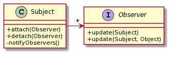
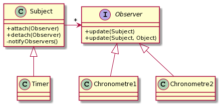

# TP1 -- Observateur/Observé

Dans ce TP, vous allez vous familiariser avec les notions observateur/observé
notamment en implémentant les classes nécessaires puis en les utilisant pour
réaliser une horloge simple.

## Le patron Observateur / Observé

La figure suivante (Graphes UML réalisés grâce à `plantuml.com`) vous présente le patron Observateur (ici « Observer ») / Observé (ici « Subject »).
L’idée est qu’un observateur peut s’inscrire auprès d’un Observé et être avertis d’évènements qui se produisent sur l’Observé.
La méthode « update() » des Observateurs est déclenchée par l’Observé chaque fois qu’il veut prévenir d’un évènement.
Il utilise pour ça sa propre méthode « notifyObservers() ».



Nous utiliserons ce pattern pour implémenter un (des) chronomètre(s).
La classe suivante implémente un thread simple qui produit un évènement toutes les secondes.
Ce TimerThread permettra de mettre à jour des horloges qui afficheront l’heure.

```java
public class TimerThread extends Thread {
  public void run(){
    while (true) {
      try {
        sleep(1000);
        // annoncer le « tick-horloge »
      } catch (InterruptedException e) {
        // on ignore et on espère que ce n’est pas grave
      }
    }
  }
}
```

Le thread s’utilise de cette façon : `new TimerThread().start();` et boucle sans fin
en faisant une action (que vous devez définir) chaque seconde.

Faites deux chronomètres, qui se mettent à jour toutes les secondes.
Ces deux chronomètres utiliseront le même Timer mais auront des temps écoulés différents (par simplicité, vous pouvez juste les initialiser à des valeurs différentes.
Commencez avec deux chronomètres console qui affiche simplement leur nom et le nombre de secondes écoulé en boucle.




Note: Des tests sont fournis dans le projet pour que vous vous assuriez que vos classes fonctionnent comme attendu.
Respectez les noms des packages, classes et méthodes

**Q1.1** Implémentez la classe Subject et l’interface Observer

```java
package fr.univlille.iutinfo.m3105.q1;
public abstract class Subject {
  public void attach(Observer obs)
  public void detach(Observer obs)
  public void notifyObervers()
  public void notifyObervers(Object data)
}

public interface Observer {
  public void update(Subject subj);
  public void update(Subject subj, Object data);
}
```

**Q1.2** Pour l’implémentation de Timer, on s’aperçoit d’un problème d’héritage.
Quelles sont les deux classes dont ce Timer devrait hériter ?

**Q1.3** Proposez une solution pour ce problème (c-a-d implémentez le Timer comme un Subject observable).
Implémentez aussi une classe chronomètre qui puisse être notifié par le Timer toutes les secondes et affiche le nombre de secondes écoulées.

```java
package fr.univlille.iutinfo.m3105.q1;
public class Timer
  public void start()
  public void stopRunning()
  ...
```

**Optionnel** Implémentez un chronomètre en JavaFX qui affiche le nombre de secondes écoulées.
Dans ce cas, notez que l'affichage JavaFX se fait dans un *thread* spécifique.
Pour que votre chronomètre JavaFX fonctionne, toute modification de l'affichage déclencée par un autre *thread* (ici le Timer) doit être fait par l'intermédiaire d'un appel à `javafx.application.Platform.runLater`,
Par exemple par une lambda telle que ceci :

```java
Platform.runLater( () -> { /* m-a-j affichage JavaFX */ } );
```
## Propriétés observables

JavaFX défini la notion de propriété observable (javafx.beans.value. ObservableValue) avec un mécanisme qui permet à un observateur d’être averti de tout changement d’état (i.e. de valeur) de la propriété (javafx.beans. property.Property).

À ceci s’ajoute les connexions qui permettent à des propriétés de s’observer mutuellement et que l’une réagisse automatiquement aux changement d’état (i.e. de valeur) de l’autre.

Il y a deux types de connexion entre les propriétés : mono ou bi-directionnelle.
La monodirectionnelle propage les changement d’une propriété (« source ») vers l’autre (« destination »), la bidirectionnelle propage les changements de n’importe laquelle des deux propriétés vers l’autre.

Ce sont des mécanismes pratiques mais qui obligent à importer JavaFX ce qui n’est pas toujours souhaitable dans un projet.
Vous devez réimplémenter ces mécanismes des propriétés.

**Q2.1** Créez la classe ObservableProperty qui soit observable.
Outre le fait qu'elle soit observable (attache, detach), cette classe doit avoir une propriété à laquelle on peut accéder :

```java
package fr.univlille.iutinfo.m3105.q2;
public class ObservableProperty
  public Object getValue()
  public void setValue(Object val)
  ...
```

Bien sûr, le fait de changer la valeur de la propriété doit être notifié aux observateurs de celle-ci.

Notez que par simplicité, on utilisera une propriété de type `Object` (donc n'importe quel type).
Vous pouvez aussi définir une classe générique avec un type paramétrique pour typer cette propriété.

**Q2.2** Créez la classe ConnectableProperty qui puisse se connecter de façon  mono ou bi-directionnelle :

```java
package fr.univlille.iutinfo.m3105.q2;

public class ConnectableProperty extends ObservableProperty
  public void connectTo(ConnectableProperty other)
  public void biconnectTo(ConnectableProperty other)
  public void unconnectFrom(ConnectableProperty other)
  ...
```